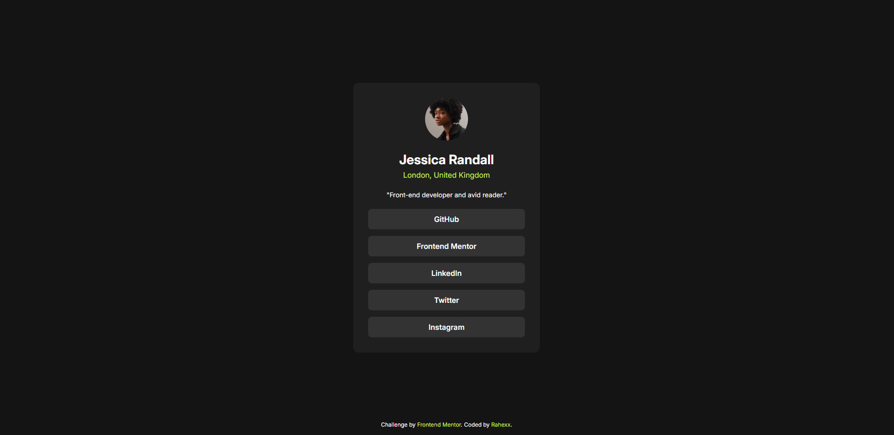

# Frontend Mentor - Social links profile solution

This is a solution to the [Social links profile challenge on Frontend Mentor](https://www.frontendmentor.io/challenges/social-links-profile-UG32l9m6dQ). Frontend Mentor challenges help you improve your coding skills by building realistic projects.

## Table of contents

- [Frontend Mentor - Social links profile solution](#frontend-mentor---social-links-profile-solution)
  - [Table of contents](#table-of-contents)
  - [Overview](#overview)
    - [The challenge](#the-challenge)
    - [Screenshot](#screenshot)
    - [Links](#links)
  - [My process](#my-process)
    - [Built with](#built-with)
    - [What I learned](#what-i-learned)
    - [Continued development](#continued-development)
  - [Author](#author)

## Overview

### The challenge

Users should be able to:

- See hover and focus states for all interactive elements on the page

### Screenshot

### Links

- Solution URL: [Add solution URL here](https://github.com/Rahexx/SocialLinks)
- Live Site URL: [Add live site URL here](https://rahexx.github.io/SocialLinks/)

## My process

### Built with

- HTML
- SCSS
- Flexbox
- Mobile-first workflow

### What I learned

I could remember myself how to use SCSS and variables in SCSS.

### Continued development

I hope in the future making more complicated projects where I will learn a lot of things.

## Author

- Frontend Mentor - [@Rahexx](https://www.frontendmentor.io/profile/Rahexx)
- LeetCode - [Rahexx](https://leetcode.com/u/Rahexx/)
